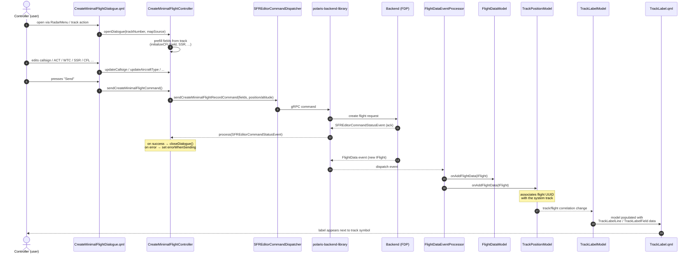

# Track Label Editor — Design Notes

This document captures a conversation about the flight record → track label flow in Polaris ASD and what is needed to build a track label configuration editor, either embedded in polaris-asd or as a standalone application in its own repository.

---

## 1. Flight record creation to track label — flow

### High-level flow

```mermaid
flowchart LR
    A[User right-clicks<br/>on map / track] --> B[CreateMinimalFlightDialogue.qml]
    B --> C[CreateMinimalFlightController<br/>holds editable EditorFields:<br/>callsign, ACT, WTC, SSR, CFL, ...]
    C -->|sendCreateMinimalFlightCommand| D[SFREditorCommandDispatcher]
    D -->|gRPC via PBL| E[(Backend / FDP)]
    E -->|FlightData event| F[FlightDataEventProcessor]
    F -->|onAddFlightData IFlight| G[IFlightDataEventHandler implementations]
    G --> H1[FlightDataModel<br/>new flight row]
    G --> H2[TrackPositionModel<br/>flight ↔ track correlation]
    H2 --> I[TrackLabelModel /<br/>TrackLabelController]
    I --> J[TrackLabel.qml<br/>renders label fields per line]
```



### Sequence (creating a minimal flight from a track)



### Key points

- The editable data lives in `FlightRecord` (full SFR editor) or in `CreateMinimalFlightController` for the lightweight "minimal flight" path.
- The command leaves the UI through `SFREditorCommandDispatcher` (`sendCreateMinimalFlightRecordCommand`) and is delivered to the backend via PBL.
- The response path is entirely event-driven: the backend re-publishes the new flight as a `FlightData` event, picked up by `FlightDataEventProcessor` (`onAddFlightData` / `onBatchAddFlightData`).
- Track labels do not subscribe to the create command directly — they reflect the flight only after the backend confirms it and `TrackPositionModel` correlates the flight UUID with a system track. `TrackLabelModel` then drives `TrackLabel.qml`.

Relevant source:
- [source/libs/asd.flight.editor/FlightRecord.h](source/libs/asd.flight.editor/FlightRecord.h)
- [source/libs/asd.flight.editor/CreateMinimalFlightController.h](source/libs/asd.flight.editor/CreateMinimalFlightController.h)
- [source/libs/asd.flight.editor/SFREditorCommandDispatcher.h](source/libs/asd.flight.editor/SFREditorCommandDispatcher.h)
- [source/businessLogic/eventProcessors/FlightDataEventProcessor.cpp](source/businessLogic/eventProcessors/FlightDataEventProcessor.cpp)
- [source/libs/asd.track.label/qml/TrackLabel.qml](source/libs/asd.track.label/qml/TrackLabel.qml)

---

## 2. Developing a track label configuration editor (in-tree)

### What you are actually editing

The "track label configuration" is an XML document validated against [schemas/tracklabel.xsd](schemas/tracklabel.xsd) (with type enums in [schemas/tracklabel-types.xsd](schemas/tracklabel-types.xsd)). Structure:

```
configuration
└── tracklabel-configuration  (@path, @radio-callsign-filepath, @has-external-transfer,
    │                         @has-force-act, @has-flight-rule-change)
    ├── tracklabel*           (@tracklabel-type: Correlated | Uncorrelated | FlightPlanTrack | Ground)
    │   └── tracklabel-line+
    │       └── (field | field18 | equipment-field)*
    ├── extended-tracklabel?  (same internal shape, @tracklabel-type = Extended)
    └── column-0-actions?     (RequestIn/Out indicators, VFR, ManualOutboundCoordTimeout, …)
```

Each `<field>` is a `TrackLabelFieldType` with:
- `field-name` — one of the enum values in `tlst:FieldType` (callsign, ssrCodeAndCallsign, clearedFlightLevel, …; ~70 values)
- attributes: `prefix`, `placeholder`, `toggleable`, `blinking`, `only-show-on-focus`, `font-adjustment`, `fixed-width-in-characters`, `left-margin`, `bottom-margin`, `visible-in-holding`
- children: zero or more `<context-menu-item>` (menu type, mouse button, press/hold, menu-position, searchable), optional `<visibility>` (control-state filter + `show-if` rule on a flight property), optional `<edit>` (mouse button enabling inline edit)
- `field18` adds child `field18-item` entries (PBN, COM, DAT, …)
- `equipment-field` selects an `EquipmentType` enum value

Constraints not in the schema but enforced/assumed by the runtime:
- The set of valid `field-name`, `field18-type`, `equipment-type`, `context-menu`, `column-0-actions`, `control-state` strings comes from the XSD enums. The editor's pickers should be generated from them rather than hard-coded.
- Some fields have special rendering paths in [TrackLabelField.qml](source/libs/asd.track.label/qml/TrackLabelField.qml): `transferArrow`, `snsInhibitedSsrDot`, `ssrCodeAndCallsign`, `freeText`, and fields with `contextMenuItems`. Toggling `toggleable`, choosing `freeText`, etc., changes which component is loaded.
- `clearedHeadingOrWaypoint` has a runtime placeholder fallback (next waypoint).

### C++ side — how the XML is consumed

- [TrackLabelConfig](source/libs/asd.track.label/config/TrackLabelConfig.h) deserializes the XML. It inherits `tern::xml::schema::XmlSchemaValidatableBase` and `tern::xml::IXmlInitializable`, so it auto-validates against the XSD on load.
- It produces `std::vector<TrackLabel>` where each `TrackLabel` contains lines of [TrackLabelLineConfig](source/libs/asd.track.label/config/TrackLabelLineConfig.h) → [TrackLabelFieldConfig](source/libs/asd.track.label/config/TrackLabelFieldConfig.h) (plus a `displayRole` derived from the field name and an `m_extendedField` flag for fields under `extended-tracklabel`).
- [TrackLabelController](source/libs/asd.track.label/TrackLabelController.h) creates a `TrackLabelModel` per track label type via `createTrackLabelModel(type)`, and `TrackLabelModel` builds a `TrackLabelLine` per `TrackLabelLineConfig`.
- The QML side (`TrackLabel.qml` → `TrackLabelContent.qml` → `TrackLabelLine.qml` → `TrackLabelField.qml`) consumes that model. Reloading `TrackLabelConfig` and rebuilding the models is enough — existing QML renders the result.

Note: the header comment in `TrackLabelConfig.h` says "generating QML files for each of the track label configurations present" — that's outdated; the current implementation does not write QML files. Rendering is data-driven.

### Where the editor fits

The codebase already has a closely-related precedent: the SFR Editor ([source/libs/asd.flight.editor](source/libs/asd.flight.editor)) for editing flight records. Mirror its patterns:

- `*Instantiator` registers QML singletons; `*Controller` exposes `Q_PROPERTY`/`Q_INVOKABLE` actions; `*Model`/`*FieldModel` are list models bound to QML; `qml/` holds the views.
- For editing structured field lists like ours, the SFR Editor's `SFREditorLineModel` / `SFREditorFieldModel` and `EditorField`/`RegexEditorField` from `asd.editor` are good templates.

Recommended decomposition:
- `TrackLabelEditorModel` — holds an in-memory representation of the XML tree (track-label-type → lines → fields).
- `TrackLabelEditorFieldModel` — list model for the fields of the currently selected line, with role-based editing.
- `TrackLabelEditorController` — load/save, validation, undo, add/remove/move fields/lines, change track label type.
- QML views per pane: tracklabel-type selector, line list with drag-reorder, field inspector, context-menu/visibility/edit sub-editors.
- A live preview pane that constructs a real `TrackLabelModel` and renders it through the existing `TrackLabel.qml` to give WYSIWYG.

### Validation and persistence

- Validation must be done against [schemas/tracklabel.xsd](schemas/tracklabel.xsd). Use the same `XmlSchemaValidatableBase` flow `TrackLabelConfig` uses; do not roll your own. For tests, call `ADD_ASD_SCHEMAS_AS_TEST_RESOURCES(target)` (see [AGENTS.md](AGENTS.md)).
- Field-name / context-menu / column-0-action / field18 / equipment / control-state pickers should be sourced from the XSD enumerations so they stay in sync.
- Cross-field rules to enforce in the UI (not in XSD): field name must allow `freeText`/`toggleable`/`contextMenuItems` combinations consistent with the component branches in [TrackLabelField.qml](source/libs/asd.track.label/qml/TrackLabelField.qml) (e.g. `freeText` doesn't combine with context menus, `transferArrow`/`snsInhibitedSsrDot`/`ssrCodeAndCallsign` are special-cased).
- Persist back as XML matching the schema. Preserve the optional sections (`extended-tracklabel`, `column-0-actions`) and the deprecated `path` attribute (the schema marks it required).

### Site/runtime concerns

- Track label XML files live under site-specific config directories (`sites/<site>/...`). The path is the `path` attribute on `tracklabel-configuration`, and the radio-callsign DB path is `radio-callsign-filepath`.
- Load order: `TrackLabelConfig::initialize(xe)` is invoked by the dynamic-loading framework (`IDynamicallyLoadable`). To pick up edits at runtime you must either reload the config and rebuild `TrackLabelModel` instances (`TrackLabelController::createTrackLabelModel`) or accept that the editor writes to disk for next-start consumption.

### Testing

- Mirror the source tree: tests at `source/tests/libs/asd.track.label/...`. Use Google Test or CxxTest (both are used in the repo; existing track-label tests use CxxTest).
- For QML pieces use `TERN_ADD_QML_TEST()` (`CMakeModules/ASDTestMacros.cmake`) with `tst_*.qml` and a `tst_<name>.cpp` harness.
- A useful integration test: load a sample XML, run it through `TrackLabelConfig`, build `TrackLabelModel`, assert the resulting line/field structure — then your editor can be tested by round-tripping (load → edit via model → serialize → reload → compare).

### Practical starting points

1. Read [source/libs/asd.track.label/config/TrackLabelConfig.cpp](source/libs/asd.track.label/config/TrackLabelConfig.cpp) end-to-end — its `extractField*` methods enumerate every attribute you need to support and reveal the implicit defaults (e.g. `addDefaultControlStates`, `getDisplayRoleForField`).
2. Read [schemas/tracklabel.xsd](schemas/tracklabel.xsd) and [schemas/tracklabel-types.xsd](schemas/tracklabel-types.xsd) — these are the authoritative spec for the editor's UI.
3. Use [source/libs/asd.flight.editor/SFREditorModel.h](source/libs/asd.flight.editor/SFREditorModel.h) and `SFREditorLineModel`/`SFREditorFieldModel` as the architectural template.
4. Reuse [TrackLabel.qml](source/libs/asd.track.label/qml/TrackLabel.qml) as the preview component so the editor is WYSIWYG against the real renderer.

---

## 3. Developing the editor as a separate application in its own repository

### Define the editor's contract clearly

The editor's only hard contract with polaris-asd is the XML file and the XSDs it must validate against:

- [schemas/tracklabel.xsd](schemas/tracklabel.xsd) — the structure.
- [schemas/tracklabel-types.xsd](schemas/tracklabel-types.xsd) — all the closed enumerations.
- [schemas/polaris-shared-types.xsd](schemas/polaris-shared-types.xsd) — imported types (e.g. `ControlType`, `stringList`).

Anything else (C++ structs, the runtime models, the QML renderer) is internal to polaris-asd and should NOT be a dependency of the editor.

Practical implications:
- Pick one canonical source of truth for the schemas. Either (a) the editor repo pulls them as a git submodule / package from polaris-asd, or (b) the schemas are extracted into a small shared "polaris-schemas" repo that both projects consume. Do not vendor-copy by hand — they will drift.
- Tag/version the schema package so the editor can declare which polaris-asd schema versions it supports.

### Decide the tech stack

| Option | Pros | Cons |
|---|---|---|
| Qt6/QML/C++ (same as polaris-asd) | Can reuse `TrackLabel.qml` and friends as a live preview; same look-and-feel; team already knows it | Heaviest setup; ties you to Qt and the Rocky8 toolchain |
| Web app (TypeScript + React/Vue) | Easiest to ship and run anywhere; easy schema-driven UI generation with JSON Schema/Ajv | Live WYSIWYG preview means reimplementing the renderer; pure XSD → form generators in JS are limited |
| Python + Qt (PySide6) | Mid-weight; fast to prototype; can still load the QML preview if you ever want WYSIWYG | New stack for the team |

If WYSIWYG matters and you accept the Qt dependency, the Qt option is by far the cheapest because you can literally load polaris-asd's `TrackLabel*.qml` files into a preview pane.

### XML model in the editor

You do not need `TrackLabelConfig.cpp` from polaris-asd. Build your own model — much simpler because it does not need to feed the runtime renderer:

- A tree class hierarchy that mirrors the XSD (`TrackLabelConfigurationDoc → TrackLabel → Line → Field/Field18/EquipmentField`) with full round-trip preservation.
- **Preserve unknown attributes, comments, and element order** when saving. The runtime loader in [TrackLabelConfig.cpp](source/libs/asd.track.label/config/TrackLabelConfig.cpp) is lossy (it normalizes things and applies defaults like `addDefaultControlStates`). An editor must not be lossy or it will silently rewrite hand-curated files.
- Validate on save using libxml2/Xerces (C++) or `xmllint`/`libxmljs`/`xmlschema` (other stacks). Use the XSD directly; do not re-implement the constraints.
- Keep the deprecated `path` attribute on `tracklabel-configuration` (it is `use="required"` in the schema).

### Drive the UI from the schema

Most of the editor's pickers (field name, field18 type, equipment type, context menu type, control states, mouse buttons, menu positions, column-0 action types) are XSD enums. Treat them as data:

- Parse the XSD once and generate dropdown contents and labels from `<xs:enumeration>` and `<xs:annotation>/<xs:documentation>`. The XSDs already contain good human-readable docs (e.g. `ActionTypeVariant` entries) — surface them as tooltips.
- Cross-field UI rules that the XSD cannot express must be encoded in the editor (and are worth documenting in a small "field capability matrix" file in the editor repo):
  - `freeText` fields don't combine with `<context-menu-item>` (see the `Loader` branches in [TrackLabelField.qml](source/libs/asd.track.label/qml/TrackLabelField.qml)).
  - `transferArrow`, `snsInhibitedSsrDot`, `ssrCodeAndCallsign` are special-cased renderers; hide irrelevant attributes for them.
  - `fontAdjustment` only matters for arrow-like fields in practice.
  - `clearedHeadingOrWaypoint` has a runtime placeholder fallback (next waypoint) — explain this in the placeholder field's help.
  - `extended-tracklabel` accepts only `tracklabel-type="Extended"`.

### Preview options (most important UX question)

Three levels:

1. **Schematic preview** — render boxes per field with the configured prefix/placeholder/width. Cheap. Works in any stack. Good first version.
2. **Reimplemented preview** — a renderer in the editor's stack that mimics `TrackLabel.qml` styling. Medium cost, drifts over time.
3. **Real preview** — embed polaris-asd's actual QML renderer. Only feasible in the Qt option; requires the editor to ship/locate the `ASD.Track.Label` QML module and stub all the C++ objects it depends on (`TrackLabelFieldTextHelper`, `FieldColorHelper`, `_workstationController`, `Style`, a fake `trackModel`). Highest fidelity but real engineering effort and a stronger version coupling to polaris-asd.

A common compromise: ship level (1) and gate level (3) behind an optional "advanced preview" that requires a polaris-asd-compatible runtime to be installed locally.

### Repository layout suggestion (Qt option)

```
polaris-tracklabel-editor/
├── schemas/                 # git submodule of polaris-schemas
├── source/
│   ├── apps/editor/         # main()
│   ├── libs/model/          # XML round-trip + validation
│   ├── libs/ui/             # QML views, controllers, undo stack
│   └── libs/preview/        # optional renderer integration
├── tests/
├── CMakeLists.txt
└── docs/
    ├── field-capability-matrix.md
    └── supported-schema-versions.md
```

Mirror polaris-asd conventions from [AGENTS.md](AGENTS.md) (Allman braces, `m_`/`s_` members, `asd.*` namespaces, PascalCase files, CxxTest or Google Test, schemas added as test resources) so a developer can move between repos without friction.

### Things to bake in from day one

- **Round-trip tests**: load every real `tracklabel-configuration.xml` from each site, save it, diff. Diff should be empty modulo whitespace policy.
- **Schema version detection**: read the `xmlns` and the imported schema versions; warn/refuse if newer than the editor knows.
- **Undo/redo** at the model level (every field edit is a single command).
- **Multi-file projects**: track labels are per-site; the editor should open a directory and let you switch between configs (`Correlated`, `Uncorrelated`, `FlightPlanTrack`, `Ground`, plus `Extended`).
- **Linting beyond XSD**: duplicate field names within a line, empty lines, unknown context-menu/field combinations, fields not legal for the given `tracklabel-type` (e.g. `transferArrow` only makes sense for some types).
- **Diff/PR-friendly serializer**: stable attribute order, stable indentation, LF endings. Keeps git diffs readable for reviewers in polaris-asd.
- **Export of generated docs**: the polaris-asd `documentation/` folder has [xsd2adoc.py](documentation/xsd2adoc.py) and [xmlExmplGenerator.py](documentation/xmlExmplGenerator.py). Reuse those (or borrow their approach) so the editor can produce reference docs from the same XSDs.

### Release/integration plan

- Editor outputs a file that is dropped into a polaris-asd site config directory. Define the relative path convention with the polaris-asd team and bake it into the editor's "Save As Site Config" flow.
- CI in the editor repo should run `xmllint --schema tracklabel.xsd --noout` against every sample and round-tripped file, and ideally also boot polaris-asd in a headless smoke test with the produced config. This is the cheapest way to detect drift between an XSD update in polaris-asd and the editor.
- Keep a small "supported schema versions" matrix in the editor's README so users know which polaris-asd releases each editor release targets.

### What you do NOT need to copy

- `TrackLabelConfig`, `TrackLabelModel`, `TrackLabelLine`, `TrackLabelLineProxyModel`, controllers, helpers — all polaris-asd runtime.
- The flight/track data models. The editor has no notion of a live flight; it only edits a static XML description.
- PBL/tern-framework/tern-map dependencies — none of them belong in this editor.

The single thing worth lifting from polaris-asd is **the schemas**, and (only if you choose the Qt route and want true WYSIWYG) the QML files under [source/libs/asd.track.label/qml](source/libs/asd.track.label/qml) as a read-only preview module. Everything else should be greenfield in the new repo.
