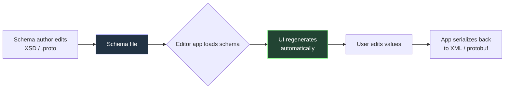
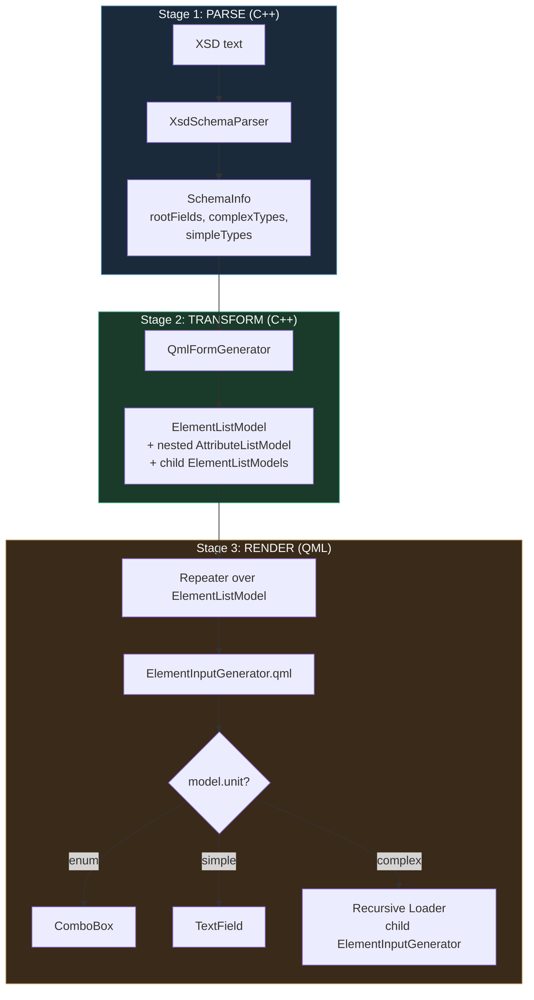
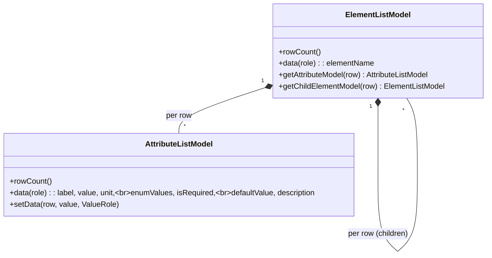
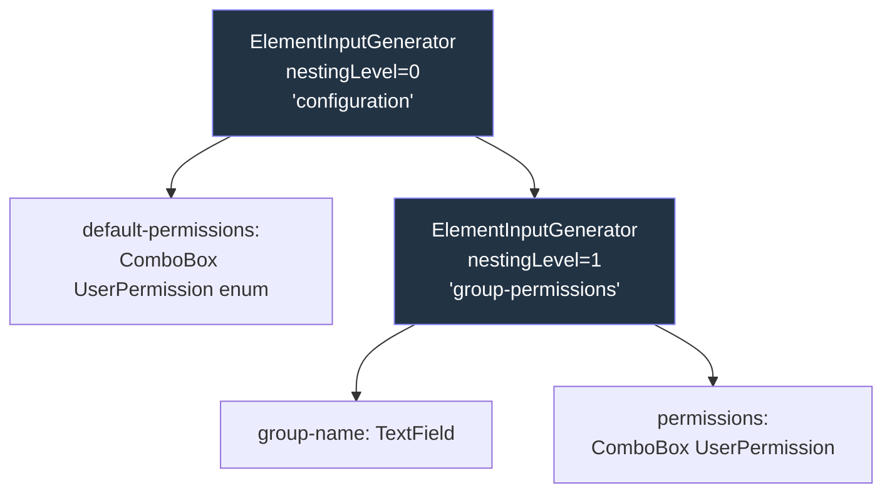
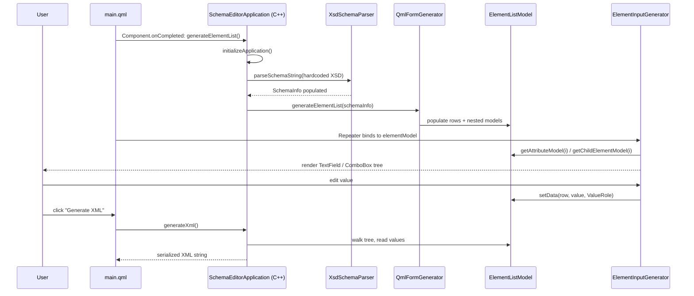

# Schema-driven UI generation

This is a deep-dive into the `schema-editor-generator` app — what it does, why it exists, and how it maps to the broader pattern used in the `aeronautical-editor`.

## 1. Why this matters

In an air-traffic-control / aeronautical system, "data" is not free-form. It is described by formal schemas:

- **XSD (XML Schema Definition)** for XML configuration (user permissions, sector profiles, runway configs, …).
- **Protobuf `.proto` files** for the aeronautical domain model (flights, tracks, airspace, sectors, …).

These schemas change. New fields get added, enumerations grow, attributes get renamed. If every editor screen is hand-written QML, then **every schema change forces a parallel QML change**, a code review, a rebuild, and a redeploy. That coupling is the bug.

The idea: treat the schema as the **single source of truth** and *derive* the editor UI from it at runtime.



Without this, the arrow from `B` → `D` is "developer writes QML by hand."

## 2. The three-stage pipeline

The `schema-editor-generator` app is the minimal, self-contained demonstrator. Its pipeline has three stages:



### Stage 1 — Parsing the XSD into a typed tree

`XsdSchemaParser` takes an XSD string and walks it in three passes:

1. **Simple types first** — every `<xs:simpleType>` becomes a `FormField` with `FieldType::Enumeration` (if it has `<xs:restriction>` + `<xs:enumeration>` values) or a primitive type. This must come first because complex types reference them.
2. **Complex types** — `<xs:complexType>` becomes a `ComplexType` containing child `FormField`s (from `<xs:sequence>`) and `attributes` (from `<xs:attribute>`).
3. **Root elements** — top-level `<xs:element>`s become entries in `SchemaInfo.rootFields`, each pointing to a complex type by name.

The output is the data structure in `SchemaTypes.h`:

```
SchemaInfo
├── rootElement: "configuration"
├── rootFields: [FormField{name=configuration, type=ComplexType, complexTypeName="configurationType"}]
├── complexTypes:
│     ├── ComplexType{name="configurationType",
│     │     fields=[group-permissions → GroupPermissions, unbounded],
│     │     attributes=[default-permissions → UserPermission, required]}
│     └── ComplexType{name="GroupPermissions",
│           attributes=[group-name: string, permissions: UserPermission]}
└── simpleTypes:
      └── FormField{name="UserPermission",
            type=Enumeration,
            enumValues=["Clearances", "FrequencyManagement", ...]}
```

Crucial detail: the parser **flattens type references**. When it sees an attribute `permissions` of type `UserPermission`, it copies the enum values directly onto the field. The QML layer never has to resolve names — it just sees `model.enumValues`.

### Stage 2 — Schema tree → Qt model tree

`SchemaInfo` is plain C++. QML can't bind to it. So `QmlFormGenerator` converts it into `QAbstractItemModel` subclasses that QML's `Repeater` understands:



The `unit` role is used as a discriminator the QML layer reads to decide *which input control to instantiate*: `"enum"`, `"complex"`, or anything else (treated as a plain text input). See `ElementInputGenerator.qml`:

```qml
sourceComponent: {
    if (model.unit === "enum")         return enumFieldComponent;   // ComboBox
    else if (model.unit !== "complex") return textFieldComponent;   // TextField
    else                               return null;                 // recurse
}
```

### Stage 3 — Recursive QML rendering

`ElementInputGenerator.qml` is a single component that renders one element:

1. A `Repeater` over the element's `AttributeListModel` emits one row per attribute, each loading a `TextField` or `ComboBox` via a `Loader`.
2. A second `Repeater` over `getChildElementModel(elementIndex)` recurses — each child element triggers another `ElementInputGenerator` instance with `nestingLevel + 1` (controlling indentation and font size).



When the user edits a field, the `TextField.onTextChanged` handler writes back through `attributeModel.setData(idx, text, Qt.UserRole + 7)` — the `ValueRole`. The state lives in the C++ model, not in QML, so `generateXml()` can serialize it on demand.

## 3. The full loop



## 4. How this generalises to the aeronautical-editor

The same idea, with a different schema language:

| Concept                | schema-editor-generator       | aeronautical-editor                |
| ---------------------- | ----------------------------- | ---------------------------------- |
| Schema source          | XSD (`<xs:complexType>`, `<xs:simpleType>`, `<xs:enumeration>`) | Protobuf (`message`, `enum`, `repeated`) |
| Type with fields       | `<xs:complexType>` → fields/attributes | `message Foo { ... }` → fields    |
| Enumeration            | `<xs:simpleType>` + `<xs:restriction>` | `enum Bar { ... }`               |
| Repeated value         | `maxOccurs="unbounded"`       | `repeated`                         |
| Required               | `use="required"` / `minOccurs>0` | `required` (proto2) / presence    |
| Documentation/tooltip  | `<xs:annotation><xs:documentation>` | `//` comments or custom options |
| Resulting UI primitive | `TextField` / `ComboBox` / nested group | same set of predefined input widgets |

The protobuf descriptors are introspectable at runtime (every protobuf message carries its own `Descriptor` describing its fields and types). So the aeronautical-editor walks `Descriptor` → builds an equivalent of `SchemaInfo` → reuses the same kind of `ElementListModel` / `AttributeListModel` → renders the same kind of recursive `ElementInputGenerator`-style component.

The big win: when an aeronautical message gains a new field (say a new `RunwayCondition` enum value), the editor picks it up the next time it loads the schema — **no QML edited, no app rebuilt for UI purposes**. Only when you want a *non-default* control for some field (e.g. a map picker for a coordinate) do you write custom QML; everything else is free.

## 5. Limits worth knowing

Looking at the actual code, the demonstrator is intentionally narrow:

- The XSD is **hardcoded** in `getApplicationSchemaString()` — there is no file-loading UI yet. To make this generic you'd wire it to the `load-files-app` pattern or a `WasmFileDialog`.
- `xs:choice` and `xs:all` are treated as `xs:sequence` in `parseComplexType`. No real choice semantics.
- `maxOccurs="unbounded"` is detected in the model (`isArray()`) but the QML doesn't yet render an "Add another" button — a single instance is shown.
- Validation is structural only; there is no XSD `pattern` / `minInclusive` enforcement at input time.
- Date/DateTime fall back to `TextField`.

These are the natural next features when promoting this from a demo into the editor backbone the aeronautical-editor uses for its protobuf equivalent.
