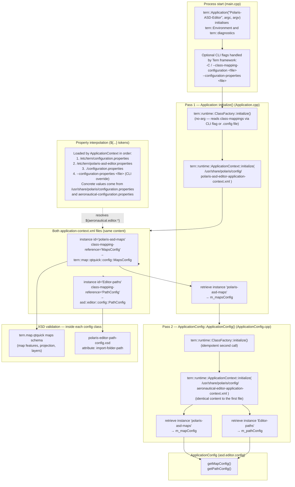

# 1. XML / XSD Configuration Loading (Input Side)

This part describes how the application bootstraps its configuration from
XSD-validated XML files at startup, before any UI is shown.

> **Note on terminology — no "beans" here.**
> The word *bean* belongs to the Java Spring Framework.
> The Tern C++ framework uses the term **instance** (`<instance>` in the XML,
> `getInstance<T*>()` in C++).  The concepts are similar (a named singleton
> created by an IoC container) but the implementation is entirely in C++.

## What this app actually is

`polaris-asd-editor` is **two editors in one process**:

| Sub-editor | Instantiator class | Config it needs |
|---|---|---|
| Map Layer Editor | `MapLayerEditorInstantiator` | `MapsConfig` only |
| Environment (Aeronautical) Editor | `EnvironmentEditorInstantiator` | `MapsConfig` + `PathConfig` (via `ApplicationConfig`) |

Because of this, config loading happens in **two separate passes** inside
`Application::initialize()`.

## Diagram

## Component-by-component

### `main.cpp` — process entry point
- Creates `tern::Application("Polaris-ASD-Editor", argc, argv)` which
  initialises `tern::Environment` and the diagnostics/tracing subsystem.
- The only CLI flags this app defines are `--version` and `-h`/`--help`.
  The Tern framework itself accepts `--class-mapping-configuration` / `-C`
  and `--configuration-properties` transparently; the app does not parse
  them manually.

### `tern::runtime::ClassFactory::initialize()` (no-arg)
- **What it does**: loads a *class-mapping configuration* XML file that
  maps short names (e.g. `"MapsConfig"`) to C++ types and their shared
  libraries.  It then knows how to `dlopen()` the right `.so` and call the
  factory function for any class referenced by name.
- **Where it reads from** (in priority order):
  1. Built-in types bundled with the framework
     (`/usr/share/tern-framework/configuration/type-mapping-configuration.xml`).
  2. `--class-mapping-configuration` / `-C` CLI flag.
  3. A file named `<executable>.config` in the execution directory.
- **In production**, `aeronautical-editor-class-mappings.xml` is supplied
  (contains `MapsConfig → libtern.map.qtquick.so` and
  `PathConfig → libasd.editor.config.so`).
- **Why IoC / dynamic loading?** It lets a deployment swap or extend a
  config class by pointing to a different shared library, without
  recompiling the editor binary.
- **Note**: `ClassFactory::initialize()` is called twice — once in
  `Application::initialize()` and once inside `ApplicationConfig()`.  The
  second call is idempotent; the framework tolerates it.

### `tern::runtime::ApplicationContext::initialize(path)`
- **What it does**: parses the XML file at `path`, finds every `<instance>`
  element, creates the object named by `class-mapping-reference` via
  `ClassFactory`, and calls `initialize(xmlNode)` on it.  The result is a
  registry of named singletons.
- **The XML tag is `<instance>`, not `<bean>`** — this is purely a Tern
  framework convention; it is not Spring.
- **Property interpolation**: before handing the XML node to each config
  object, `ApplicationContext` replaces `${key}` tokens with values from
  `.properties` files loaded from standard locations (see *Property
  interpolation* below).
- Instances are retrieved later via
  `ApplicationContext::getInstance<T*>("instance-id")`.
- **Called twice** with two different (but currently identical) files:
  - `polaris-asd-editor-application-context.xml` in pass 1 (map layer editor)
  - `aeronautical-editor-application-context.xml` in pass 2 (`ApplicationConfig`)

### Property interpolation — `${...}` tokens
The `<instance>` XML files are full of tokens like
`${aeronautical.editor.map.main.center.lat}`.  `ApplicationContext` resolves
them automatically from `.properties` files merged in this order (later
overrides earlier):

1. `/etc/tern/configuration.properties`
2. `/etc/tern/polaris-asd-editor.properties`
3. `./configuration.properties`
4. `--configuration-properties <file>` from the CLI (optional override)

In practice the values flow through two files:

- `/usr/share/polaris/configuration.properties` — the system-wide defaults
  (thousands of `pasd.*` keys for every Polaris component).
- `/usr/share/polaris/config/aeronautical-configuration.properties` — a
  thin adapter that re-exports `pasd.*` keys under the
  `aeronautical.editor.*` namespace that the XML uses.

### `MapsConfig` (instance `polaris-asd-maps`)
- **C++ class**: `tern::map::qtquick::config::MapsConfig`
  in `libtern.map.qtquick.so`.
- **Interfaces implemented**: `IDynamicallyLoadable`, `IXmlInitializable`,
  `XmlSchemaValidatableBase` — the standard triple for any Tern config class.
- **Input**: XML fragment carrying `<map:configuration>` with map features
  (coastline colours), main-map viewport (centre, range, zoom limits,
  projection extent), and layer file paths.  All numeric/color values arrive
  as already-resolved property values.
- **XSD validation**: happens inside the class via
  `XmlSchemaValidatableBase`; uses the `tern.map.qtquick` maps schema.
- **Output**: `getMapFeatures()` and a full `MapsConfig` value used by both
  sub-editors when constructing map renderers.
- **Why shared**: both the Map Layer Editor and the Environment Editor need
  to render the same map; sharing one instance keeps them in sync.

### `PathConfig` (instance `Editor-paths`)
- **C++ class**: `asd::editor::config::PathConfig`
  in `libasd.editor.config.so`.
- **Input**: single XML attribute `import-folder-path`, resolved at startup
  to `/opt/polaris/aeronautical/` (from `aeronautical-configuration.properties`).
- **XSD validation**: against
  [`polaris-editor-path-config.xsd`](../../schemas/polaris-editor-path-config.xsd)
  — declares the attribute as required.
- **Output**: `getImportFilePath()` returning the root path used by the
  in-app file browser.
- **Why not hardcoded**: keeps the path configurable per deployment (e.g.
  a different mount point in a container) without recompiling.

### `ApplicationConfig` facade
- **Source**: [`ApplicationConfig.cpp`](../../source/libs/asd.editor.config/ApplicationConfig.cpp)
- **What it does**: its constructor calls `ClassFactory::initialize()` and
  `ApplicationContext::initialize(aeronautical-editor-application-context.xml)`,
  then retrieves both instances from the context by id.
- **Output**: typed getters `getMapConfig()` and `getPathConfig()` consumed
  by `EnvironmentEditorInstantiator`.
- **Currently exposes two getters** — `getMapConfig()` and `getPathConfig()`.
  No `TrackLabelConfig` exists yet.
- **Why a facade?**: isolates the rest of the codebase from
  `ApplicationContext` lookup strings; consumer code only depends on a
  `shared_ptr<ApplicationConfig>`.

### NEW `TrackLabelConfig` (planned extension hook)
- Does not exist in the codebase yet.
- **When added**, it would follow the same `XmlSchemaValidatableBase` +
  `<instance>` pattern: a dedicated XSD-validated XML fragment, a new
  `<instance>` entry in the context file, a new getter on `ApplicationConfig`.
- **Why the same pattern**: keeps config changes confined to XML/XSD files
  and a new config class; the bootstrap and facade code stay untouched.
