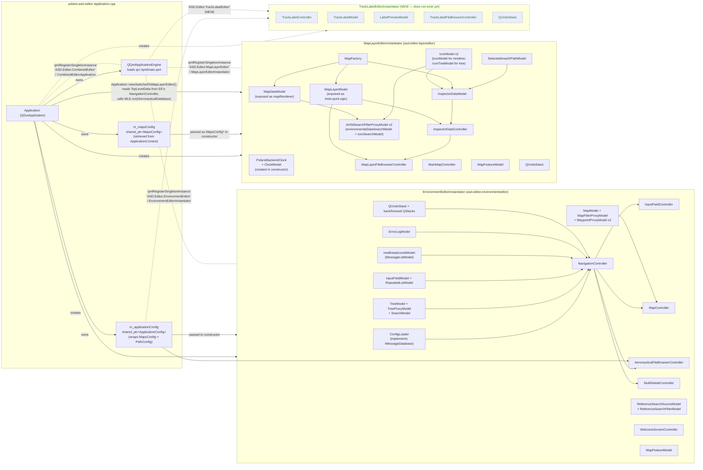

# 2. Internal Application Wiring

This part describes what happens after config is loaded: how the top-level
`Application` instantiates the two sub-editor `Instantiator` classes, how
their controllers/models are constructed, and how they are exposed to QML.

> **Two editors, one process.**
> `polaris-asd-editor` hosts both the **Environment (Aeronautical) Editor**
> and the **Map Layer Editor** in a single `QGuiApplication`.  They share a
> map config but have separate object graphs.  When the user switches views,
> `Application::viewSwitchedToMapLayerEditor()` pulls the live aeronautical
> data from the Environment Editor and passes it into the Map Layer Editor.

## Diagram

## Top-level shell

### `Application` (polaris-asd-editor)
Source: [Application.cpp](../../source/apps/polaris-asd-editor/Application.cpp)

- **What it owns**: the `QQmlApplicationEngine`, a `shared_ptr<MapsConfig>`,
  a `shared_ptr<ApplicationConfig>`, a `unique_ptr<MapLayerEditorInstantiator>`,
  and a `unique_ptr<EnvironmentEditorInstantiator>`.
- **Construction order** (inside `initialize()`):
  1. `ClassFactory::initialize()` — loads class-mapping configuration.
  2. `ApplicationContext::initialize("polaris-asd-editor-application-context.xml")`
     — creates the `polaris-asd-maps` instance.
  3. `m_mapsConfig` — retrieved from the context and copied into a
     `shared_ptr<MapsConfig>`.
  4. `MapLayerEditorInstantiator(m_mapsConfig.get(), /*isCombined=*/true)` —
     receives a raw `MapsConfig*`, **not** `ApplicationConfig`.
  5. `ApplicationConfig()` — triggers a second context load
     (`aeronautical-editor-application-context.xml`) and retrieves both
     `polaris-asd-maps` and `Editor-paths`.
  6. `EnvironmentEditorInstantiator(m_applicationConfig, /*isCombined=*/true)`.
- **QML exposure**: registers itself as the singleton
  `CombinedEditorApplication` in module `"ASD.Editor.CombinedEditor"`, and
  also registers `MapFeatureModel` as a QML type in `"tern.map.qtquick"`.
- **Cross-editor handoff**: `Q_INVOKABLE viewSwitchedToMapLayerEditor()` —
  QML calls this method on `Application`; it reads the live protobuf from
  `m_environmentEditorInstantiator->navigationController()->getConfiguration()`,
  converts it with `fromProtobuf()`, and calls
  `m_mapLayerEditorInstantiator->run(database)`.  Neither instantiator calls
  the other directly.

## EnvironmentEditorInstantiator (Aeronautical Editor)

Source: [EnvironmentEditorInstantiator.cpp](../../source/apps/aeronautical-editor/libs/asd.editor.environmenteditor/EnvironmentEditorInstantiator.cpp)

Everything is created in the **constructor** (no separate `run()` method).
The constructor receives a `shared_ptr<ApplicationConfig>`.

**QML singleton**: `qmlRegisterSingletonInstance("ASD.Editor.EnvironmentEditor",
1, 0, "EnvironmentEditorInstantiator", this)` — accessed in QML as
`EnvironmentEditorInstantiator`. It is **not** a context property.

### `ConfigLoader`
- **Input**: `ApplicationConfig` (passed in constructor; provides access to
  `PathConfig` for the default import root). File path is set later via
  `setFilePath()`.
- **Output**: a `shared_ptr<google::protobuf::Message>`
  (`tern::aeronautical::protobuf::TopLevelData`) dispatched on file extension:
  - no extension → DAFIF directory → `DafifAeronauticalDatabaseLoader::loadDafifDatabase`
  - `.xml` root `<DAFIF>` → `DafifAeronauticalDatabaseLoader::loadXmlDatabase`
  - `.xml` root `<AIXMBasicMessage>` → Xerces AIXM loader
  - `.json` → protobuf JSON deserialization via `AeronauticalFileBrowserController::importConfig`
- **Why**: one place that knows all input formats; everything else works with
  a protobuf message and doesn't care how it was loaded.
  Source: [ConfigLoader.cpp](../../source/apps/aeronautical-editor/libs/asd.editor.environmenteditor/ConfigLoader.cpp).

### `TreeModel` / `TreeProxyModel` / `SearchModel`
- **Input**: the protobuf message hierarchy, exposed through Qt's reflection
  model API.
- **Output**:
  - `TreeModel` — the raw `QAbstractItemModel` of the document tree.
  - `TreeProxyModel` — filters hidden nodes (role `TreeModel::Hidden`).
  - `SearchModel` — proxy on `TreeModel` for the search box.
- **Why**: lets the user navigate arbitrary protobuf message types without a
  hand-rolled model per type.

### `InputFieldModel` + `RepeatedListModel` + `InputFieldController`
- **Input**: the protobuf field(s) currently selected in the tree.
- **Output**: a list of editable fields with type info; undo-able edits
  pushed to `QUndoStack` via `InputFieldController`.
- **Why**: generic field editor driven by protobuf field descriptors — add a
  new message type and the editor adapts automatically.

### `MessageListModel` (treeBreadcrumbModel)
- **Input**: navigation events from `NavigationController`.
- **Output**: the breadcrumb trail shown above the tree (list of ancestor
  message names).
- **Why**: lets the user see where in the document hierarchy they are.

### `ErrorLogModel`
- **Input**: `TreeModel` row-insert/remove signals.
- **Output**: a list of validation errors that the QML error-log panel
  consumes.
- **Why**: tracks which tree indices are invalid so errors remain
  synchronized as the document changes.

### `NavigationController`
- **Input**: `shared_ptr<google::protobuf::Message>` (null at construction,
  set when a file is loaded), the `ConfigLoader` (as `IMessageDatabase`),
  `TreeModel`, `InputFieldModel`, `RepeatedListModel`,
  `treeBreadcrumbModel`, `QUndoStack`, backward `QStack<int>`, forward
  `QStack<int>`, and `ErrorLogModel`.
- **Output**: emits `treeSelectedIndicesChanged`, `configurationUpdate`,
  `indicesUpdated`, `messageRemoved`; exposes `getConfiguration()` returning
  the live protobuf message.
- **Why**: single source of truth for the currently edited document;
  everything (input fields, map, deletion, export) subscribes to it.

### `WelcomeScreenController`
- **Input**: `ConfigLoader`.
- **Output**: manages the welcome / landing screen before a file is opened.
- **Why**: separates "no file loaded" UI state from the main editor.

### `MapModel` + `MapFilterProxyModel` + `WaypointProxyModel` (×2)
- **Input**: geometry data from the live protobuf (updated via
  `MapController` signals).
- **Output**:
  - `MapModel` — flat list of all map entities with type/geometry roles.
  - `MapFilterProxyModel` — filters by entity type (routes, airspaces, …).
  - Two `WaypointProxyModel` instances — one isolates waypoints, the other
    (inverted) isolates non-waypoint features.
- **Why**: the map renderer needs to separate waypoints from other features
  for different rendering passes.

### `MapController`
- **Input**: `NavigationController`, `MapModel`, `TreeModel`,
  `ApplicationConfig`, `ErrorLogModel`.
- **Output**: populates `MapModel` from the protobuf; handles
  `selectEntityFromEditor()` (tree → map selection) and
  `mapDataUpdate()` / `onIndicesUpdated()` / `onMessageRemoved()` (document
  changes → map refresh).
- **Why**: keeps map rendering reactive to document edits without coupling
  the tree directly to the map.

### `ReferenceSearchSourceModel` + `ReferenceSearchFilterModel`
- **Input**: `NavigationController` + `InputFieldModel`.
- **Output**: a searchable/filterable list of referenceable entities
  (navaids, waypoints, etc.) for inline field lookup.
- **Why**: lets the user pick a cross-reference value by name rather than
  typing a raw identifier.

### `AeronauticalFileBrowserController`
- **Input**: `NavigationController` (current document state) +
  `ApplicationConfig` (gives access to both `PathConfig.importFilePath()`
  and map config).
- **Output**: import/export entry points called from QML; also provides the
  static helpers `getFileExtension()` and `importConfig()` used by
  `ConfigLoader`.
- **Why**: bridges the QML file browser to the document owner.

### `MultiDeleteController`
- **Input**: `NavigationController` + `QUndoStack`; listens to
  `treeSelectedIndicesChanged` to clear its internal selection list.
- **Output**: undoable bulk-delete commands on the protobuf message.
- **Why**: validates that all selected nodes are deletable as a group before
  pushing a single undo command.

## MapLayerEditorInstantiator

Source: [MapLayerEditorInstantiator.cpp](../../source/apps/map-layer-editor/libs/asd.editor.layereditor/MapLayerEditorInstantiator.cpp)

> **Important — two-phase construction.**
> The **constructor** receives only `MapsConfig*`; it creates `ClockModel` /
> `PolarisBackendClock` and registers the QML singleton.  Everything else
> (`MapFactory`, `MapDataModel`, `MapLayerModel`, `InspectorDataController`,
> etc.) is created inside `run(IAeronauticalDatabase)`, which is only called
> later by `Application::viewSwitchedToMapLayerEditor()`.

**QML singleton**: `qmlRegisterSingletonInstance("ASD.Editor.MapLayerEditor",
1, 0, "MapLayerEditorInstantiator", this)`.

**Constructor input**: `MapsConfig*` — a raw pointer to the `MapsConfig`
object already held by `Application`. **Not** `ApplicationConfig`.

### `ClockModel` + `PolarisBackendClock`
- Created in the constructor (before any aeronautical data exists).
- **Input**: system/backend time stream from `PolarisBackendClock`.
- **Output**: a `ClockModel` exposed as a QML property for the header bar.
- **Why**: the clock must be visible even before the user loads a file.

### `MapFactory`
- Created in `run()`.
- **Input**: `shared_ptr<IAeronauticalDatabase>` handed in by `Application`.
- **Output**: produces map features (airspaces, routes, waypoints) consumed
  by `MapDataModel` and `MapLayerModel`.
- **Why**: decouples aeronautical domain objects from rendering primitives.

### `IconModel` (×2: `iconModel` + `iconTreeModel`)
- Both created in `run()`.
- **Input**: feature data and per-icon style.
- **Output**:
  - `iconModel` — flat icon set for the map renderer.
  - `iconTreeModel` — structured icon grouping for the tree view.
- **Why**: the renderer and the tree need different views of the same icon
  data.

### `MapDataModel` (exposed as QML property `mapRenderer`)
- Created in `run()`.
- **Input**: `iconModel` + `MapFactory`.
- **Output**: layer collection used by the QML map renderer; supports
  `toggle()`, `getLayerCollection()`, search-filter callbacks.
- **Why**: manages the visual state of all rendered layers.

### `MapLayerModel` (exposed as QML property `treeLayerLogic`)
- Created in `run()`.
- **Input**: `iconTreeModel` + `QUndoStack` + `IAeronauticalDatabase`.
- **Output**: `QAbstractItemModel` of the layer tree; contains
  `MapLayerPresetModel` internally for preset management.
- **Why**: backbone of the layer editor's tree UI and undo-aware layer
  operations.
- **Note**: both `MapDataModel` and `MapLayerModel` are created from the
  same `IAeronauticalDatabase`; neither feeds the other.

### `InspectorDataModel` + `InspectorDataController`
- Created in `run()`.
- **`InspectorDataModel` input**: `iconTreeModel`, `MapFactory`,
  `QUndoStack`, `SelectedAreaOrPathModel`.
- **`InspectorDataController` input**: `MapLayerModel`,
  `InspectorDataModel`, `QUndoStack`.
- **Output**: editable property bundle for the inspector panel.
- **Why**: separates "what is selected and what are its properties"
  (model) from "how the user acts on them" (controller).

### `SelectedAreaOrPathModel`
- Created in `run()`.
- **Input**: `IAeronauticalDatabase`.
- **Output**: the currently selected area or path geometry used by the
  inspector to show spatial extent.
- **Why**: inspector needs geometric context that isn't stored in the layer
  model itself.

### `AIXMSearchFilterProxyModel` (×2)
- Both created in `run()`.
- `environmentalDataSearchModel` — wraps `MapDataModel` with mode
  `MapDataModel`; drives search in the data list.
- `iconSearchModel` — wraps `iconModel` with mode `IconModel`; drives
  search in the icon list and controls map-layer visibility on filter/search.
- **Why**: the same proxy class handles both search targets with different
  modes; changes in `iconSearchModel` trigger the `onSearch` / `onFilter`
  lambdas that toggle layer geometry visibility.

### `MapLayerFileBrowserController`
- Created in `run()`.
- **Input**: `MapLayerModel`, `InspectorDataController`.
- **Output**: import/export `.tar` archives of map-layer configurations.
- **Why**: layer presets are distributed as tarballs; the controller
  extracts on import and re-packs on export.

### `MainMapController` + `MapFeatureModel`
- Both created at the end of `run()`.
- **`MainMapController` input**: `MapsConfig` (the one received in the
  constructor).
- **`MapFeatureModel` input**: `mapsConfig->getMapFeatures()` — the list of
  cartographic features (coastlines, etc.).
- **Output**: QML properties `mainMapController` and `mapFeatureModel`.
- **Why**: the map viewport (pan, zoom, daylight mode) is controlled
  separately from the layer data.

## NEW `TrackLabelEditorInstantiator` (planned, does not exist yet)

When added, it will follow the same pattern as the two existing
instantiators:

| Component | Input | Output | Reason |
|-----------|-------|--------|--------|
| `TrackLabelController` | user actions from QML | mutates `TrackLabelModel`, pushes undo commands | central command handler for the editor |
| `TrackLabelModel` | initial data from `TrackLabelConfig` | `QAbstractItemModel` of label templates | drives the QML list/tree of label definitions |
| `LabelPreviewModel` | currently selected template + sample track data | rendered preview properties | lets the user see the label as it would appear on a track in the ASD |
| `TrackLabelFileBrowserController` | `TrackLabelModel`; browser root from `PathConfig` (or new dedicated path) | import/export entry points | mirrors the two existing browser controllers |
| `QUndoStack` | controller commands | undo/redo history | consistent UX with the other editors |
