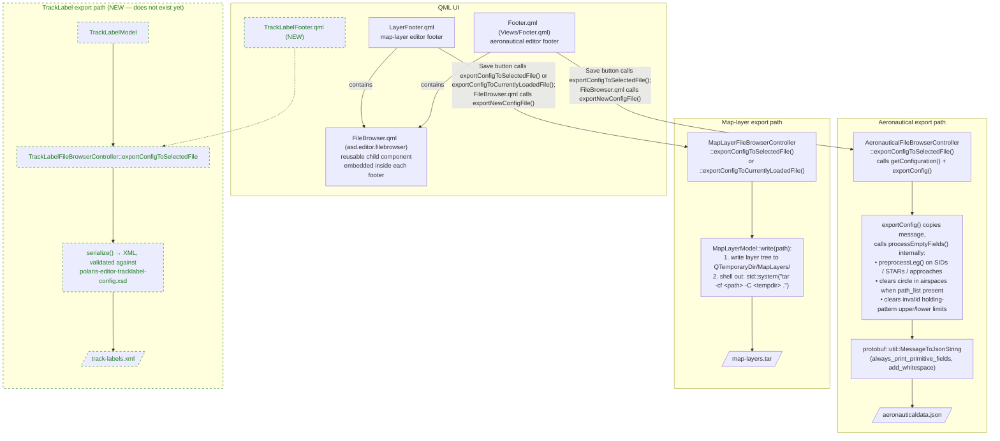

# 3. Configuration Output / Persistence

This part describes how each sub-editor writes its state back to disk.

> **How the QML and C++ sides connect.**
> `FileBrowser.qml` is a **reusable component** (in `asd.editor.filebrowser`)
> that is embedded *inside* each editor's footer QML.  The footer passes its
> own `fileBrowserController` into it.  The footer is also where the Save /
> Load button lives and calls `fileBrowserController.exportConfigToSelectedFile()`
> directly.  `FileBrowser.qml` only handles the "Save as new file" path
> (calling `fileBrowserController.exportNewConfigFile()`).

## Diagram

## Shared base: `FileBrowserControllerBase`

Source: [FileBrowserControllerBase.h](../../source/libs/asd.editor.filebrowser/FileBrowserControllerBase.h),
[FileBrowserControllerBase.cpp](../../source/libs/asd.editor.filebrowser/FileBrowserControllerBase.cpp).

- **QML properties** (bound to in each footer): `selectedFile`,
  `exportFileName`, `exportFileType`, `nameFilters`, `importPath`,
  `isSelectedAFolder`, `canLoadFromSelectedFile`.
- **Pure virtual hooks** subclasses must implement:
  - `exportConfigToSelectedFile()` — save to the currently selected file.
  - `importConfigFromSelectedFile()` — load from the currently selected file.
  - `exportNewConfigFile(name, folderUrl)` — create a new file and save.
  - `onSelectedFilenameChanged()` — called whenever `selectedFile` changes;
    each subclass uses it to update `canLoadFromSelectedFile`.
- **Static helpers** available to all subclasses: `removeFilePrefix()`,
  `getFileExtension()`.
- **`Q_INVOKABLE` helpers** callable from QML: `removeFile()`, `renameFile()`.
- **Why**: factors the boilerplate (file:// prefix handling, name filters,
  rename/remove) shared by every editor's file browser controller, leaving
  each subclass to handle only its own serialization format.

## Aeronautical export

Source: [AeronauticalFileBrowserController.cpp](../../source/apps/aeronautical-editor/libs/asd.editor.environmenteditor/controllers/AeronauticalFileBrowserController.cpp).

**Constructor** sets: `importPath` = `applicationConfig->getPathConfig().getImportFilePath()`
(resolves to `/opt/polaris/aeronautical/`); `exportFileName` = `"aeronauticaldata"`;
`exportFileType` = `".json"`; `nameFilters` = `{ "*.json", "*.xml", "*.txt", "*.TXT" }`.

### `exportConfigToSelectedFile()`
- The single entry point called by the QML footer's Save button.
- Calls `exportConfig(selectedFilenameWithPath(), *m_navigationController->getConfiguration())`.
- `NavigationController::getConfiguration()` is therefore called **here**,
  not as a separate earlier step.

### `exportConfig(fileNameWithPath, message)` (static)
- **Makes a copy** of `message` via `message.New()` + `CopyFrom()` so the
  in-memory state is never modified by export.
- Calls `processEmptyFields(copy)` internally.
- Verifies the file path ends in `.json`; logs `TraceError` and returns
  `false` otherwise.
- Serialises the copy with `protobuf::util::MessageToJsonString` (options:
  `always_print_primitive_fields = true`, `add_whitespace = true`).
- Strips the `file://` prefix and opens with `QIODevice::WriteOnly |
  QIODevice::Text` (overwrites existing file).

### `processEmptyFields(message)` (static)
- Called inside `exportConfig()` on the copy — **not** called by the footer.
- **What it actually does** (more than the name suggests):
  1. **SIDs, STARs, approaches**: iterates every leg and calls
     `MapController::preprocessLeg(leg)` to fill in derived geometric fields.
  2. **Airspaces**: for each airspace volume, if `boundary.path_list` is
     non-empty, clears the `circle` field (they are mutually exclusive; the
     wrong one would confuse downstream consumers).
  3. **Holding patterns**: clears `upper_limit` or `lower_limit` if their
     `value` is empty or their `unit_of_measurement` / `reference` is
     `NOT_SET`.
- **Why**: ensures the exported JSON is valid for downstream Polaris
  components without needing further enrichment or cleanup.

### `exportNewConfigFile(name, folderUrl)`
- Appends `.json` to `name` if missing; strips trailing slashes from
  `folderUrl`.
- Opens with `QIODevice::WriteOnly | QIODevice::Text | QIODevice::NewOnly`
  (fails if file already exists — prevents accidental overwrites).
- Delegates to `exportConfigToSelectedFile()`.
- **Why**: implements "Save as new" without clobbering existing files.

## Map-layer export

Source: [MapLayerFileBrowserController.cpp](../../source/apps/map-layer-editor/libs/asd.editor.layereditor/controllers/MapLayerFileBrowserController.cpp).

**Constructor** sets: `importPath` = `""` (empty — no configured root, the
file browser starts at the system root); `exportFileName` = `"map-layers"`;
`exportFileType` = `".tar"`; `nameFilters` = `{ "*.TAR", "*.tar" }`.

### `MapLayerModel::write(outputURI)`
- Strips the `file://` prefix from the URI.
- Creates a `QTemporaryDir` and writes the full layer tree into
  `<tempdir>/MapLayers/` — one numbered subdirectory per root layer
  (e.g. `01#LayerName/`), layer XML files and optional `.cfg` / preset
  config files inside.
- Shells out via **`std::system("tar -cf <outputPath> -C <tempdir> .")`** to
  produce the final `.tar` archive.
  > **Note**: this requires the `tar` binary to be on `$PATH` at runtime.
- **Why tar**: a layer configuration is a directory tree of per-layer XML
  files; a single `.tar` archive is the format used to distribute and
  exchange presets.

### `exportConfigToSelectedFile()`
- Calls `m_mapLayerModel->write(selectedFilenameWithPath())`.
- Used for "Save" when overwriting the currently selected file.

### `exportConfigToCurrentlyLoadedFile()`
- Calls `m_mapLayerModel->write(m_currentlyLoadedFileName)`.
- Used for "Save" when overwriting the file that was last imported.
- **Why two methods**: `selectedFilenameWithPath()` tracks the file browser
  selection (may change as the user browses); `m_currentlyLoadedFileName`
  tracks what was actually opened and is stable.

### `exportNewConfigFile(name, folderUrl)`
- Appends `.tar` to `name` if missing; strips trailing slashes from
  `folderUrl`.
- Opens with `QIODevice::WriteOnly | QIODevice::Text | QIODevice::NewOnly`
  (fails if file already exists).
- Delegates to `exportConfigToSelectedFile()`.
- **Why**: same "Save as new" semantics as the aeronautical side.

## NEW `TrackLabelFileBrowserController` (planned, does not exist yet)

- **Input**: `TrackLabelModel` snapshot; selected file from QML.
- **Output**: XML file validated against
  `schemas/polaris-editor-tracklabel-config.xsd` (the same schema used to
  load it). Optionally provide a JSON form for interop.
- **Why**: round-trips cleanly — the file exported by the editor can be
  loaded again as `TrackLabelConfig` at the next startup.
