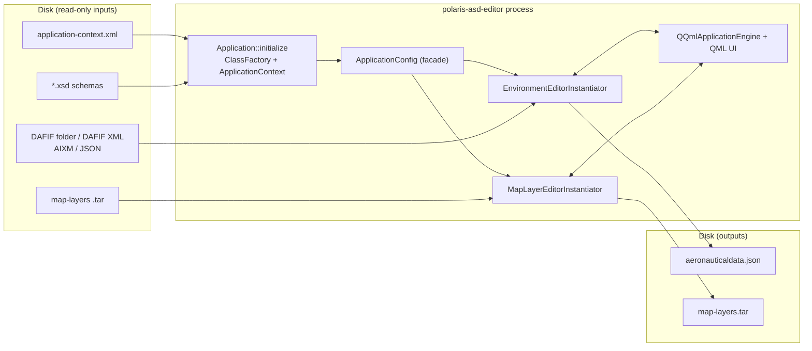

# Polaris ASD Editor — Architecture Documentation

This directory documents the configuration / data flow architecture of the
`polaris-asd-editor`, focusing on how XML/XSD-validated configuration is
loaded, how the sub-editors are wired together internally, and how data is
persisted back to disk.

## Contents

1. [01-config-loading.md](01-config-loading.md) — **Input side**: XML/XSD
   bean instantiation, `ApplicationContext`, `ApplicationConfig` facade.
2. [02-internal-wiring.md](02-internal-wiring.md) — **Internal connectivity**:
   the top-level `Application`, the two `Instantiator` classes, the
   controllers/models inside each, and the QML bindings.
3. [03-config-output.md](03-config-output.md) — **Output side**: file browser
   controllers, protobuf/JSON/TAR serialization paths.
4. [04-tracklabel-editor-extension.md](04-tracklabel-editor-extension.md) —
   Worked example of extending the application with a new
   `TrackLabelEditor` sub-editor, following the existing patterns.

Each file contains a focused Mermaid diagram plus a per-component table
describing inputs, outputs, and the reason the component exists.

## High-level system view

