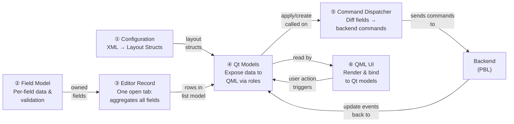
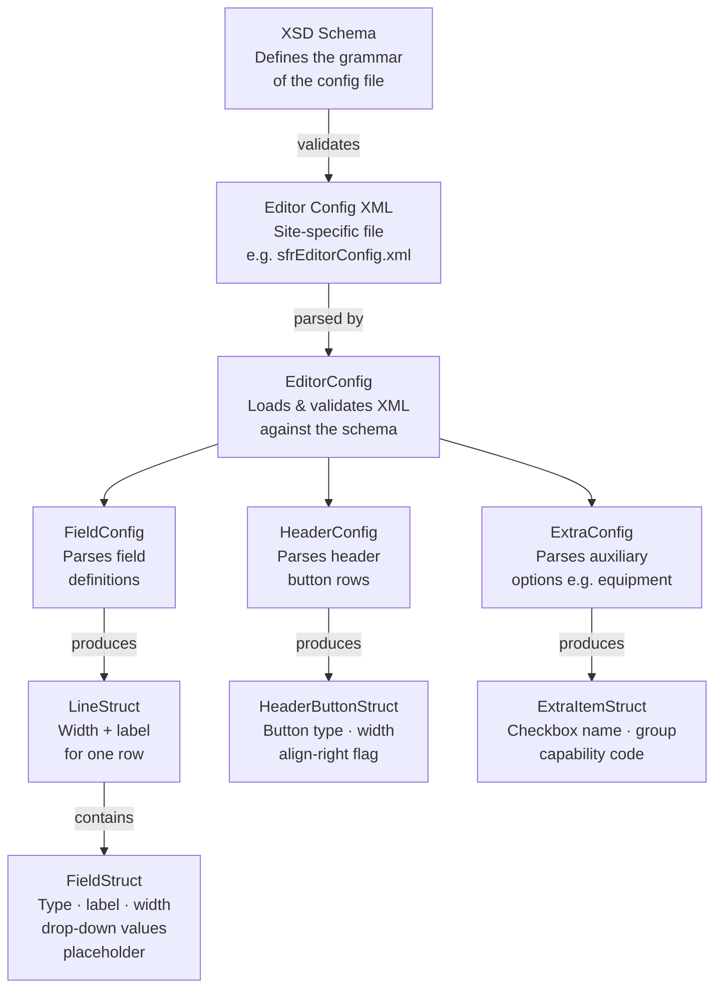
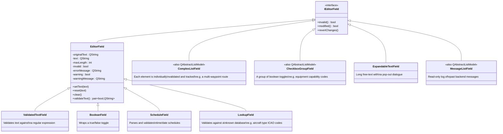
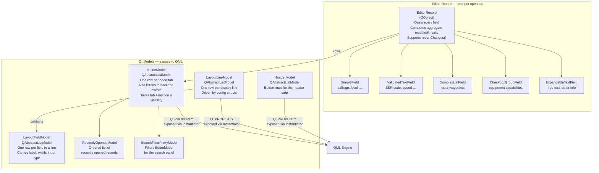
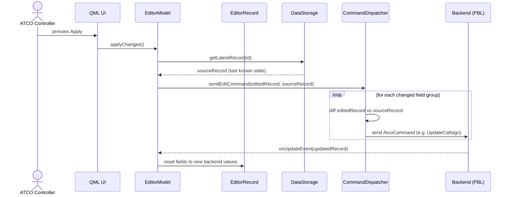
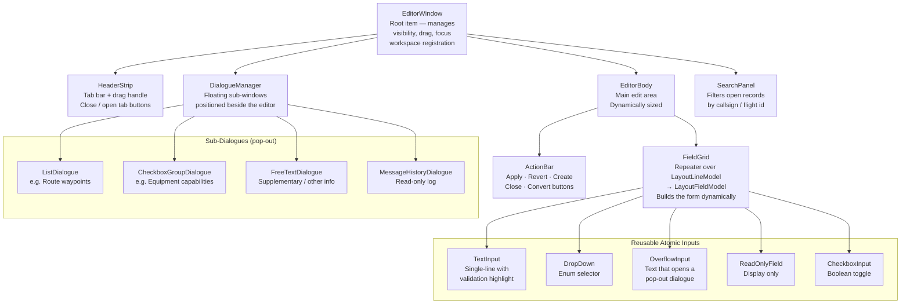

# Editor Architecture — Polaris ASD

This document analyses the internal architecture of the existing **Flight Record (SFR) Editor**
(`source/libs/asd.flight.editor`) as a reference model for future editors, specifically the
planned **Track Label Editor** and **Flight List Editor**.

The class names used in diagrams and descriptions are **generic** — they describe the role
each component plays, not the exact class name in the SFR editor codebase.

---

## 1. Layered Architecture Overview

An editor in Polaris ASD is composed of six distinct layers, assembled by a single
**Instantiator** that wires them together and exposes them to the QML engine.



| #   | Layer                  | One-line job                                                                         |
| --- | ---------------------- | ------------------------------------------------------------------------------------ |
| 1   | **Configuration**      | Parse XML into layout structs describing which fields appear and how                 |
| 2   | **Field Model**        | Store, validate, and track changes for a single piece of data                        |
| 3   | **Editor Record**      | Group all fields belonging to one open editor tab                                    |
| 4   | **Qt Models**          | Expose records and layout to QML as `QAbstractListModel` rows                        |
| 5   | **Command Dispatcher** | Compare edited fields to the last-known backend state and send only the changed ones |
| 6   | **QML UI**             | Render the window; bind inputs to Qt model roles                                     |

---

## 2. Diagram A — Configuration: From XML to Layout

The editor layout is **entirely data-driven**. No hard-coded field positions exist in C++ or QML.
An XML file (validated against an XSD schema) is parsed into plain C++ structs that describe
every line, field, and button in the editor.



> **Key insight:** Structs carry no Qt or QML dependency. They can be constructed and
> inspected in plain unit tests without a QApplication.

---

## 3. Diagram B — Field Model: Tracking What the User Typed

The `asd.editor` library provides a **reusable, editor-agnostic** set of field types.
Every field knows its current value, its original value, and whether it is valid.



> **Note:** Fields that contain a list of items (route waypoints, equipment checkboxes,
> message history) additionally inherit `QAbstractListModel` so QML can iterate them directly.

---

## 4. Diagram C — Editor Record & Qt Models: From Fields to QML

An **Editor Record** groups all fields for one open tab. The **Qt Models** sit above the
records and translate them into the role-based API that QML consumes.



> `EditorModel` uses **roles** (integer constants, one per field/flag) so QML can bind
> directly to e.g. `model.callsign` or `model.isModified` without extra controllers.

---

## 5. Diagram D — Command Dispatcher: Turning Edits into Backend Commands

When the controller presses **Apply**, the dispatcher compares the edited record against
the last-known backend snapshot and emits exactly the commands needed — one per changed
field group.



The dispatcher also handles **create** (new record), **convert** (minimal → full), and
**cancel coordination** flows. Each is a separate method on the `ICommandDispatcher` interface
so it can be mocked in tests.

---

## 6. Diagram E — QML UI: Component Hierarchy

The QML layer is a **thin presentation tier**. It contains no business logic — it only
binds to the Qt models exposed by the Instantiator singleton.



---

## 7. Layer-by-Layer Explanation

### 7.1 Configuration

All editor layout is **data-driven via XML**, validated against XSD schemas in `schemas/`.
The config class inherits three tern-framework interfaces:

- `IDynamicallyLoadable` — can be loaded/reloaded at runtime
- `IXmlInitializable` — parsed from an XML element
- `XmlSchemaValidatableBase` — validated against the XSD before use

It produces plain C++ structs (line, field, header button, extra-item) that describe the
visual layout (widths, labels, field types, drop-down values) with **no Qt or QML
dependency**. This makes the config layer independently testable.

### 7.2 Domain / Field Model (`asd.editor`)

`asd.editor` is a **reusable base library** independent of any specific editor's data
concepts.

- **`IEditorField`** — pure interface: `invalid()`, `modified()`, `revertChanges()`
- **`EditorField`** — concrete base (`Q_GADGET`): stores current and original text, exposes
  `typeHint`, `maxLength`, `errorMessage`, `warningMessage`. Validation is overridable via
  `validateText()`.
- **Specialisations** — `ValidatedTextField` (regex), `BooleanField`, `ScheduleField`,
  `LookupField`, and complex list fields (`ComplexListField`, `CheckboxGroupField`,
  `ExpandableTextField`, `MessageListField`).
- Complex fields subclass **both** `QAbstractListModel` *and* `IEditorField`, giving them
  independent list-model behaviour for their QML delegates.

### 7.3 Editor Record

The Editor Record is a `QObject` that **owns one field (or specialisation) per editable data
point** on a single tab. It is constructed either empty (new record) or populated from a
backend data object. It provides:

- Aggregate `modified()` / `invalid()` computed across all contained fields
- `revertChanges()` delegated to every contained field
- The single source of truth for "what the controller has typed so far"

### 7.4 Qt Models

| Model                      | Role                                                                                                                                                                                            |
| -------------------------- | ----------------------------------------------------------------------------------------------------------------------------------------------------------------------------------------------- |
| **EditorModel**            | Top-level `QAbstractListModel`; one row = one open tab (Editor Record). Also registers itself as a listener for backend event handler interfaces. Drives tab visibility, selection, and search. |
| **LayoutLineModel**        | List of display lines; each row references a `LayoutFieldModel`.                                                                                                                                |
| **LayoutFieldModel**       | List of field metadata (type, label, width, input context, drop-down values) for one line. Used by QML repeaters to build the form layout dynamically.                                          |
| **HeaderModel**            | List of header button rows.                                                                                                                                                                     |
| **RecentlyOpenedModel**    | Ordered list of recently opened record IDs.                                                                                                                                                     |
| **SearchFilterProxyModel** | Proxy on `EditorModel` for the search panel.                                                                                                                                                    |

`EditorModel` roles (integer constants, one per field/flag) cover every editable field *and*
dialogue-visibility flags, allowing QML to bind directly without additional controllers.

### 7.5 Command Dispatcher

`ICommandDispatcher` defines the contract for translating editor state to backend operations.
The concrete implementation:

1. Compares the edited Record against the latest backend snapshot (from `IDataStorage`)
2. Builds zero or more typed command objects — **one per changed field group**
3. Sends them through the backend interface (`IPolarisBackEnd`)

Each comparison is encapsulated in a private `create*Command()` method, making the
dispatcher easy to unit-test and extend independently. A `CommandFieldConstructor` helper
converts free-text field values into strongly-typed domain values expected by each command.

### 7.6 QML UI

The QML layer is a thin presentation tier that binds to Qt models via the Instantiator
(registered as a QML singleton):

| Component | Purpose |
|-----------|---------|
| `EditorWindow` | Root item; manages visibility, drag, focus, workspace registration |
| `HeaderStrip` | Tab bar + drag handle |
| `EditorBody` | Main edit area; dynamically sized to its content |
| `ActionBar` | Apply / Revert / Create / Close buttons |
| `FieldGrid` | Repeater over `LayoutLineModel` → `LayoutFieldModel`; builds form dynamically |
| `DialogueManager` | Manages floating sub-dialogues positioned beside the editor |
| `SearchPanel` | Filters open tabs by identifier |
| `EditorComponents/` | Reusable atomic inputs: text, dropdown, overflow, read-only, checkbox |
| `EditorDialogues/` | Full sub-dialogues for complex fields: list, checkbox group, free text, message log |

### 7.7 Instantiator

The Instantiator is the **composition root**. It is constructed once at application startup
and:

- Owns all shared instances via `std::shared_ptr`
- Takes all external dependencies as constructor parameters (backend, config, event
  processors, command dispatcher)
- Exposes `EditorModel`, `LayoutLineModel`, `HeaderModel`, and any helper controllers as
  `Q_PROPERTY` constants so QML can access them via the singleton name

---

## 8. Key Design Patterns

| Pattern                                  | Where used                                                                                                                                                      |
| ---------------------------------------- | --------------------------------------------------------------------------------------------------------------------------------------------------------------- |
| **Interface-based dependency injection** | All external systems accessed through interfaces (`IDataStorage`, `ICommandDispatcher`). Makes unit testing straightforward with mocks.                         |
| **Data-driven UI layout**                | Config structs drive both `LayoutLineModel`/`LayoutFieldModel` and the QML repeaters; adding a new field requires only XML + enum changes, no C++ or QML edits. |
| **Command pattern**                      | Each field edit becomes a discrete typed command — atomic, independently testable, and easy to extend.                                                          |
| **Event handler fan-out**                | `EditorModel` registers for multiple backend event handler interfaces; updates arrive as typed callbacks, not generic signals.                                  |
| **Composition root (Instantiator)**      | Single class owns the object graph, keeping construction order explicit and preventing circular dependencies.                                                   |
| **Role-based list models**               | `QAbstractListModel` with custom integer roles lets QML bind to any field property without extra controllers or adapters.                                       |

---

## 9. Guidance for the Planned Editors

### Track Label Editor (`asd.track.label.editor`)

Likely needs:
- A **Track Label Record** owning fields for label line content, offset position, etc.
- An **`ITrackLabelCommandDispatcher`** dispatching label offset/content commands
- A simple **`TrackLabelEditorModel`** (single-row or per-track list model)
- A **config** describing which label fields are editable per site
- A **`TrackLabelInstantiator`** as the composition root

The `asd.editor` field library (`IEditorField`, `EditorField`, `ValidatedTextField`) should be
reused directly.

### Flight List Editor (`asd.flight.list.editor`)

Likely needs:
- A **List Row Record** per editable row — either a lightweight specialisation reusing
  `EditorField`, or the full flight record with a smaller active field set
- A **`FlightListEditorModel`** that wraps the existing `FlightDataModel` and adds per-row
  edit state (modified, invalid, selected)
- Column layout driven by config (the same `LayoutLineModel` / `LayoutFieldModel` pattern)
- Commands dispatched via the existing `IAtcoCommandDispatcher`
- A **`FlightListInstantiator`** registering the model with the QML engine

In both cases the **same six-layer structure** applies:

```
Config → Field Model → Record → Qt Model → Command Dispatcher → QML
```
